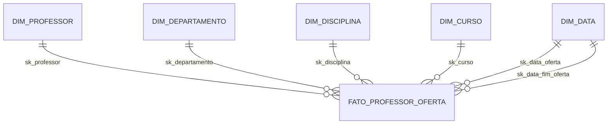

# Star Schema de Professores

Modelagem dimensional (*star schema*) voltada à **análise dos dados de professores** de uma universidade, construída a partir de um diagrama relacional fornecido.

## Sumário

1. [Sobre o projeto](#1-sobre-o-projeto)
2. [Estrutura do repositório](#2-estrutura-do-repositório)
3. [Diagramas](#3-diagramas)
4. [Processo de negócio e granularidade](#4-processo-de-negócio-e-granularidade)
5. [Tabela fato e medidas](#5-tabela-fato-e-medidas)
6. [Dimensões](#6-dimensões)
7. [Decisões de modelagem](#7-decisões-de-modelagem)
8. [Suposições e limitações](#8-suposições-e-limitações)
9. [Perguntas de negócio atendidas](#9-perguntas-de-negócio-atendidas)
10. [Conclusão](#11-conclusão)

---

## 1. Sobre o projeto

O modelo parte do diagrama relacional fornecido, composto por **Professor, Departamento, Disciplina, Curso, Disciplina & Curso, Pré-requisitos, Pré-requisitos das disciplinas, Aluno e Matriculado**.

O objetivo é criar um esquema em estrela com foco em **professores**, refletindo os cursos que ministram e o departamento ao qual pertencem. Conforme o enunciado, **os dados de alunos foram desconsiderados**. Também foi adicionada uma **dimensão de datas**, já que o modelo relacional não possui nenhum campo de data.

## 2. Estrutura do repositório

```
.
├── README.md
├── docs/
│   ├── modelo_relacional.png        # diagrama de origem
│   └── star_schema.png              # diagrama dimensional
└── sql/
    ├── 01_criacao_tabelas.sql       # schema, dimensões e fato
    ├── 02_popula_dim_data.sql       # calendário 2020-2030
    ├── 03_popula_dimensoes_e_fato.sql   # dados fictícios
    └── 04_consultas_analiticas.sql  # consultas de exemplo
```

## 3. Diagramas

### Modelo relacional (origem)


### Modelo dimensional (star schema)


Versão simplificada das relações:



## 4. Processo de negócio e granularidade

O processo modelado é a **oferta de disciplinas por professor**. A tabela fato `fato_professor_oferta` tem a seguinte granularidade:

> **Uma linha para cada professor, ministrando uma disciplina, em um curso, em um período de oferta.**

No modelo relacional, o professor só se conecta a cursos e departamentos por meio das disciplinas. Para analisá-lo em todos esses contextos, a fato reúne os quatro no mesmo nível de detalhe.

## 5. Tabela fato e medidas

**`fato_professor_oferta`**

| Campo | Tipo | Descrição |
|---|---|---|
| `sk_professor` (FK) | INT | Chave para `dim_professor` |
| `sk_departamento` (FK) | INT | Chave para `dim_departamento` |
| `sk_disciplina` (FK) | INT | Chave para `dim_disciplina` |
| `sk_curso` (FK) | INT | Chave para `dim_curso` |
| `sk_data_oferta` (FK) | INT | Data de início da oferta (`dim_data`) |
| `sk_data_fim_oferta` (FK) | INT | Data de fim da oferta (`dim_data`, *role-playing*) |
| `qtd_disciplinas` | INT | Contador da oferta (sempre 1) |
| `carga_horaria` | INT | Horas da disciplina na oferta |
| `qtd_prerequisitos` | INT | Número de pré-requisitos da disciplina |

**Chave primária composta:** `(sk_professor, sk_disciplina, sk_curso, sk_data_oferta)`

| Medida | Aditividade |
|---|---|
| `qtd_disciplinas` | Aditiva |
| `carga_horaria` | Aditiva, com ressalva (ver [seção 8](#8-suposições-e-limitações)) |
| `qtd_prerequisitos` | Semiaditiva: somar entre disciplinas diferentes exige critério |

## 6. Dimensões

| Dimensão | Conteúdo |
|---|---|
| `dim_professor` | Nome, titulação, regime de trabalho, data de admissão e `flag_coordenador` (derivado da relação Departamento → professor coordenador) |
| `dim_departamento` | Nome, campus e coordenador |
| `dim_disciplina` | Nome, carga horária padrão e informação de pré-requisito (`tem_prerequisito`, `nome_prerequisito`) |
| `dim_curso` | Nome, nível, modalidade e duração em semestres |
| `dim_data` | Dia, dia da semana, mês, bimestre, trimestre, semestre, ano, semestre letivo e indicador de período letivo (2020 a 2030) |

Todas as dimensões usam **chaves substitutas** (`sk_`), mantendo a chave natural da origem com restrição `UNIQUE` para evitar duplicidade na carga.

## 7. Decisões de modelagem

1. **Eliminação de tabelas associativas.** A tabela *Disciplina & Curso*, que resolvia a relação N:N, deixou de existir. A relação passou a ser representada pelas linhas da fato, em que cada combinação disciplina/curso ofertada gera um registro.
2. **Desnormalização dos pré-requisitos.** *Pré-requisitos* e *Pré-requisitos das disciplinas* foram incorporadas à `dim_disciplina`, evitando um *snowflake* e simplificando as consultas.
3. **Exclusão de Aluno e Matriculado**, conforme o enunciado.
4. **Dimensão de datas como *role-playing*.** A `dim_data` é referenciada duas vezes pela fato (início e fim da oferta). Nas consultas, ela é usada duas vezes com apelidos diferentes.
5. **Indicador de coordenador na dimensão.** O `flag_coordenador` descreve o professor, e não a oferta, então fica somente na `dim_professor`.

## 8. Suposições e limitações

### Suposições

O modelo relacional não possui campos de data nem vários atributos descritivos. Conforme autorizado no enunciado, foram supostos:

- nome, titulação, regime e data de admissão do professor;
- nome, carga horária, nível, modalidade e duração de disciplinas e cursos;
- datas de início e fim das ofertas;
- a regra de período letivo da `dim_data` (janeiro, julho e dezembro como meses não letivos).

Todos os dados inseridos nas tabelas são **fictícios**.

### Limitação

Quando um professor ministra a mesma disciplina a dois cursos no mesmo semestre, a carga horária aparece em duas linhas da fato e uma soma direta a conta em duplicidade. Para obter a carga horária real, a análise deve contar cada combinação **professor + disciplina + período** uma única vez (consulta 2 em [`sql/04_consultas_analiticas.sql`](sql/04_consultas_analiticas.sql)).

Uma alternativa seria uma fato adicional, com granularidade de professor por disciplina e período, sem a dimensão de curso.

## 9. Perguntas de negócio atendidas

- Quantas disciplinas cada professor ministra por semestre?
- Qual a carga horária total por professor e por departamento?
- Quantos cursos cada departamento atende?
- Quais professores são coordenadores e o que ministram?
- Como evoluíram as ofertas e a carga horária ao longo dos semestres?

### Exemplo de consulta

Carga horária por departamento e semestre:

```sql
SELECT
  d.semestre_letivo,
  dep.nome_departamento,
  COUNT(DISTINCT f.sk_professor) AS professores,
  SUM(f.qtd_disciplinas)         AS ofertas,
  SUM(f.carga_horaria)           AS carga_horaria_total
FROM fato_professor_oferta f
JOIN dim_data         d   ON d.sk_data = f.sk_data_oferta
JOIN dim_departamento dep ON dep.sk_departamento = f.sk_departamento
GROUP BY d.semestre_letivo, dep.nome_departamento
ORDER BY d.semestre_letivo, dep.nome_departamento;
```

## 11. Conclusão

O esquema em estrela proposto centraliza a análise de professores em uma única tabela fato, cercada por cinco dimensões descritivas. Ele reduz a quantidade de junções em relação ao modelo relacional original, torna as consultas analíticas mais simples e permite análises por tempo, departamento, curso e disciplina.


